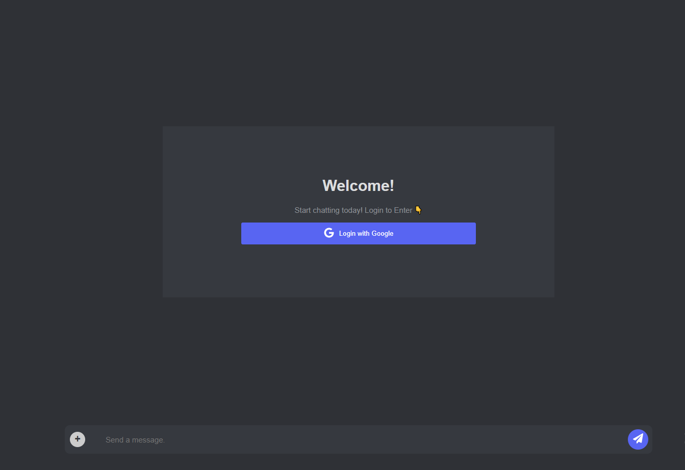

# Chat Application with Firebase

A real-time chat application built using React and Firebase, allowing users to send messages, images, videos, and audio files.



## Deployment
[](https://app.netlify.com/sites/messeng3r/deploys)

The chat application is deployed and accessible at the following link:

https://messeng3r.netlify.app/


## Table of Contents

- [Features](#features)
- [Getting Started](#getting-started)
  - [Prerequisites](#prerequisites)
  - [Installation](#installation)
- [License](#license)

## Features

- User authentication using Google sign-in.
- Real-time messaging with Firebase Firestore.
- Support for sending images, videos, and audio files.
- Smooth scrolling to the latest messages.
- Responsive design for various screen sizes.

## Getting Started

### Prerequisites

- Node.js and npm installed on your machine.
- A Firebase project with Firestore, Authentication, and Storage enabled.

### Installation

1. Clone the repository:

   ```bash
   git clone https://github.com/hello202320/firebase.git
   ```

   ```bash
   cd firebase
   ```

2. Install dependencies:

   ```bash
   npm install
   ```

3. Set up your Firebase configuration:

   - Rename `.senv` to `.env`.
   - Add in your values in `.env` with your Firebase project's configuration.


## License

This project is licensed under the [MIT License](LICENSE).

---

